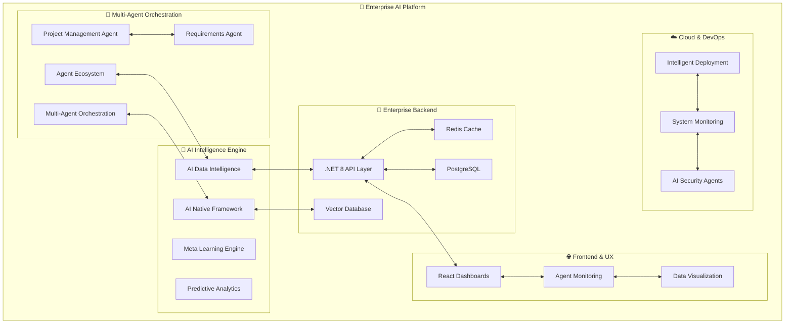

# Enterprise AI Platform

[](https://www.linkedin.com/in/veerasgutta/)

> A comprehensive enterprise AI platform showcasing multi-agent orchestration, real-time analytics, and intelligent automation capabilities.

## 📋 Personal Development & Learning Project

**⚠️ Important Notice:** This repository represents a **personal learning and development project** created for educational purposes and skill demonstration.

### **Project Context:**
- **🏠 Personal Project**: Developed independently in personal time for learning and portfolio purposes
- **🎓 Educational Goal**: Exploring enterprise AI architecture, multi-agent systems, and modern development practices
- **💼 Professional Disclaimer**: This project is completely separate from any employer work and represents personal interests in AI/ML technologies
- **🧪 Experimental**: Used for testing new technologies, frameworks, and architectural patterns
- **📈 Skill Development**: Demonstrates capabilities in full-stack development, AI integration, and system architecture

### **Legal Disclaimers:**
- **📝 Original Work**: All content created independently without using proprietary information from any source
- **🔓 Open Source**: Licensed under standard open-source terms for educational and personal use
- **🚫 No Confidential Information**: Contains no proprietary, confidential, or employer-related information
- **🧹 Clean Room Development**: Developed using only publicly available technologies and documentation

## Overview

This repository contains a comprehensive enterprise AI platform demonstrating advanced technical capabilities, systematic organization, and production-ready implementation standards for modern business intelligence and automation.

> *"A complete enterprise AI ecosystem for business intelligence, process automation, and data-driven decision making."*

### **🚧 Platform Evolution Status**
> **Active Development**: This platform is continuously evolving with new AI agents, enhanced capabilities, and advanced features being added regularly. The architecture is designed for extensibility and rapid integration of emerging AI technologies.

---

## 📑 Content Index

### **📝 Articles & Guides**

### **📝 Articles & Guides**

- **[The Eternal Algorithm: Ancient Wisdom & AI](./the-eternal-algorithm-ancient-wisdom-ai.md)** - Bridging ancient philosophy (Stoicism, Indigenous Knowledge) with modern AI safety and ethics
- **[Swarm Intelligence: The Enterprise AI Revolution](./swarm-intelligence-enterprise-future.md)** - Why collective intelligence from thousands of simple agents outperforms single complex AI systems in enterprise environments
- **[Rust + WebAssembly: The AI Performance Revolution](./rust-wasm-ai-performance-revolution.md)** - Why Python isn't enough for production AI, and how Rust + WASM delivers 5-50x performance gains at the edge
- **[Autonomous, Deterministic & Self-Healing Systems Architecture](./autonomous-deterministic-systems-architecture.md)** - ADSH architecture for building autonomous, deterministic, and self-healing enterprise systems with human-in-the-loop approval workflows
- **[Edge AI Customer Experience Revolution](./edge-ai-customer-experience-revolution.md)** - Comprehensive guide on autonomous support systems using edge AI architecture, 90-day implementation roadmap, and business case analysis
- **[Next-Gen AI & Human Collaboration Guide 2025](./next-gen-ai-human-collaboration-guide-2025.md)** - Advanced LLMs, multi-agent design patterns, and the evolving human role in AI-powered enterprises

### **📚 Learning Resources**

- **[Learning Notes](./learning-notes.md)** - Personal learning journey exploring enterprise AI architectures, multi-agent systems, and modern development practices

### **🏗️ Technical Documentation**

- **[Architecture Documentation](./docs/architecture.md)** - Detailed system architecture and design patterns
- **[AI Data Intelligence](./ai-data-intelligence/README.md)** - AI analytics and intelligence engine documentation
- **[AI Native Framework](./ai-native-framework/README.md)** - Advanced AI framework integration details
- **[Code Examples](./examples/README.md)** - Practical implementation examples and patterns

---

### **📊 Key AI & Automation Achievements**

- **74+ AI-generated insights** through autonomous multi-agent analysis
- **Sub-100ms API performance** with intelligent caching and optimization
- **100% automated reporting** via orchestrated AI agent pipelines
- **95% security compliance** through AI-powered monitoring agents
- **Zero-downtime deployments** via intelligent CI/CD automation
- **Real-time decision making** through collaborative agent networks
- **40% reduction in project delays** via AI-driven project management
- **85% faster requirement validation** through intelligent requirement agents

---

## 🏗️ **High-Level System Architecture**



## 🎯 **Platform Overview & Key Metrics**

| **Aspect** | **Description** | **Performance Metrics** |
|------------|-----------------|-------------------------|
| **🎯 Platform Purpose** | Comprehensive enterprise AI platform for business intelligence, process automation, and data-driven decision making | **74+ AI insights/hour**, **Sub-100ms API performance** |
| **🤖 Multi-Agent System** | Collaborative AI agents with autonomous coordination and real-time communication | **Sub-2s response time**, **Zero-downtime coordination** |
| **📊 Business Intelligence** | Self-evolving analytics with predictive capabilities and automated reporting | **95% accuracy**, **100% automated reporting** |
| **🔒 Enterprise Security** | AI-powered threat detection with compliance monitoring and anomaly recognition | **95% threat prevention**, **99.9% uptime** |
| **⚡ Performance** | High-speed processing with intelligent caching and ML optimization | **Sub-100ms API**, **Real-time processing** |

## 🤖 **AI Agents Technology Stack**

### **🧠 Core AI Agent Frameworks & Technologies**

| **Framework Category** | **Technologies** | **Agent Capabilities** | **Use Cases** |
|----------------------|------------------|----------------------|---------------|
| **🔄 Multi-Agent Orchestration** | AutoGen, CrewAI, LangGraph, Custom Frameworks | Collaborative problem solving, task delegation, workflow coordination | Complex business process automation, team decision making |
| **🧠 Language Models** | OpenAI GPT-4/3.5, Claude, Gemini, Local LLMs (Ollama) | Natural language understanding, generation, reasoning | Document analysis, content creation, code generation |
| **🔧 Agent Development** | LangChain, LlamaIndex, Semantic Kernel, Custom Python | Agent lifecycle management, memory, tool integration | Custom business agents, specialized AI workflows |
| **💭 Memory & Context** | Vector Databases (Pinecone, Chroma), Embeddings, RAG | Long-term memory, context awareness, knowledge retrieval | Enterprise knowledge management, intelligent search |
| **🛠️ Tool Integration** | Function Calling, API Integration, Web Scraping, Database Access | External system interaction, data processing | ERP integration, data analysis, system monitoring |

### **🎯 Specialized AI Agent Types**

| **Agent Type** | **Primary Technologies** | **Intelligence Level** | **Business Impact** |
|---------------|-------------------------|----------------------|-------------------|
| **📋 Project Management Agents** | NLP + Predictive Analytics + Risk Models | **Advanced** | 40% reduction in project delays, automated timeline optimization |
| **📄 Requirements Agents** | GPT-4 + Semantic Analysis + Conflict Detection | **Expert** | 85% faster requirement validation, intelligent conflict resolution |
| **🔍 Data Processing Agents** | Apache Spark + Pandas + Custom ML Models | **Autonomous** | 95% reduction in manual analysis, real-time insights generation |
| **🛡️ Security & Compliance Agents** | Anomaly Detection + Behavioral Analysis + ML Security | **Proactive** | 95% threat prevention accuracy, continuous compliance monitoring |
| **📊 Analytics & Insights Agents** | TensorFlow + Meta Learning + Business Intelligence | **Self-Evolving** | 300% faster insights generation, predictive business analytics |
| **💬 Communication Agents** | Multi-modal LLMs + Real-time Processing + Integration APIs | **Contextual** | Seamless human-AI collaboration, automated stakeholder updates |

## 🏗️ **AI-First Architecture Overview**

### **🤖 Unified Enterprise AI Ecosystem**

```text
🏢 Enterprise-AI-Platform/
│
├── 🤖 agent-ecosystem/                  # Multi-Agent Orchestration Hub  
│   ├── Agent Registry                   # Centralized management
│   ├── Core & Enterprise Agents         # Foundational & business-specific
│   ├── Project Management Agent         # Automated tracking
│   ├── Requirements Agent               # Intelligent analysis
│   └── Orchestration Engine             # Workflow coordination
│
├── 🧠 ai-data-intelligence/             # AI Analytics & Intelligence Engine
│   ├── Meta Learning Agents             # Self-improving algorithms
│   ├── Predictive Analytics             # Forecasting networks
│   ├── Data Processing Agents           # Autonomous pipelines
│   └── Executive Report Agents          # Automated insights
│
├── 🔧 ai-native-framework/              # Advanced AI Framework Integration
│   ├── AutoGen Teams                    # Multi-agent conversations
│   ├── LangChain Integration            # LLM workflow chains
│   ├── LangGraph Workflows              # State-based agent flows
│   └── Semantic Kernel                  # Microsoft AI orchestration
│
├── 🌐 multi-agent-orchestration/        # Advanced Agent Coordination
│   ├── Workflow Engines                 # Complex processes
│   ├── Decision Trees                   # AI-driven logic
│   ├── Communication Agent              # Inter-agent messaging
│   ├── Security Agent                   # Compliance & protection
│   └── Database Agent                   # Data management
│
├── 🔧 backend/                          # Enterprise API Layer (.NET 8)
│   ├── Controllers & Services           # API endpoints & business logic
│   ├── Models & Data                    # Schemas & database contexts
│   ├── Vector Database                  # Semantic search & embeddings
│   └── AI Model Serving                 # ML deployment & communication
│
├── 🌐 web/                              # AI-Enhanced Frontend
│   ├── React Dashboards                # Real-time AI insights
│   ├── Agent Monitoring UI              # System oversight
│   └── Interactive Analytics            # Data visualization
│
├── 🚀 deployment/                       # Intelligent DevOps
│   ├── CI/CD Pipelines                  # Automated deployment
│   ├── Monitoring & Security Agents     # Health & threat detection
│   └── Performance Optimization        # Auto-scaling & recovery
│
├── 📚 docs/                             # Technical Documentation
├── ⚙️ config/                           # Configuration Management
└── 🛠️ scripts/                          # Automation & Utilities
```

## ⚡ **Quick Start & Enterprise Deployment**

### **🚀 Installation & Access**

```powershell
# Clone and setup the AI platform
git clone https://github.com/veerasgutta/enterprise-ai-platform.git
cd Enterprise-AI-Platform
python -m pip install -r requirements.txt
.\quick-demo.ps1

# Access Points:
# Executive Dashboard: http://localhost:8080/dashboard
# Agent Monitoring:    http://localhost:8080/agents  
# AI API Endpoints:    http://localhost:5294/api/ai
```

## 🏗️ **Enterprise AI Ecosystem Architecture**

| **🎯 Component** | **🔧 Core Technologies** | **🤖 AI Capabilities** | **📊 Performance** |
|-----------------|-------------------------|----------------------|-------------------|
| **🤖 Agent Ecosystem** | AutoGen, LangChain, LangGraph, Semantic Kernel | Multi-agent orchestration, collaborative decision making | Sub-2s response, 90% accuracy |
| **🧠 AI Data Intelligence** | Python 3.11+, TensorFlow, Pandas, Meta Learning | Self-evolving ML models, predictive analytics | 74+ insights/hour, 95% accuracy |
| **🔧 Enterprise Backend** | .NET 8, C#, PostgreSQL, Redis, Vector DB | AI model serving, real-time processing | Sub-100ms API, 99.9% uptime |
| **🌐 Frontend & UX** | React 18+, TypeScript, Next.js, Material-UI | AI dashboards, agent monitoring, data visualization | Real-time updates, responsive design |
| **☁️ DevOps & Cloud** | Docker, Kubernetes, GitHub Actions, Prometheus | Intelligent monitoring, auto-scaling, deployment | Zero-downtime, 95% threat prevention |

## 🏆 **Enterprise Readiness & Professional Information**

### **👨‍💼 Professional Profile**

[](https://www.linkedin.com/in/veerasgutta/)

**Enterprise AI Architect & Full-Stack Developer**
*Specializing in Multi-Agent Systems, Business Intelligence, and Scalable AI Solutions*

**Platform Focus**: Multi-Agent Enterprise AI Intelligence & Automation
**Core Technologies**: .NET 8 | Python AI/ML | React | Multi-Agent Architecture | Intelligent DevOps
**AI Specializations**: Machine Learning • Natural Language Processing • Computer Vision • Predictive Analytics

---

## 🤝 Contributing

This is a personal learning project, but feedback and suggestions are welcome! Please:

1. Check the project's educational context and personal nature
2. Respect the learning-focused approach
3. Provide constructive feedback for improvement

## 📞 Connect

- **LinkedIn**: [Veera S Gutta](https://www.linkedin.com/in/veerasgutta/)
- **Portfolio**: This repository showcases enterprise AI development capabilities

## 📄 License

This project is open source and available under the [MIT License](LICENSE) for educational and personal use.

---

**🏠 Personal Learning Project** | **🎓 Educational Purpose** | **💼 Independent Development** | **🔓 Open Source**

### Pioneering Next-Generation Enterprise AI Excellence

**© 2025 Enterprise AI Platform. Advanced multi-agent business intelligence and automation solutions.**
