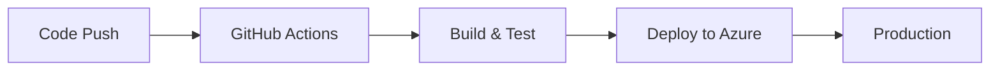
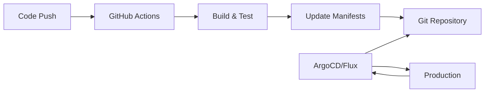

# GitOps Implementation for Enterprise Platform

## 🔄 What is GitOps?

GitOps is a deployment methodology where:
1. **Git as Single Source of Truth**: All infrastructure and application configs in Git
2. **Declarative Descriptions**: Desired state described declaratively 
3. **Automated Deployment**: Agents automatically sync Git state to live systems
4. **Continuous Reconciliation**: System continuously corrects drift

## 🆚 GitOps vs GitHub Actions

### Current GitHub Actions Approach


### GitOps Approach  


## 🎯 Benefits for Enterprise Platform

### **1. Enhanced Security**
- No cluster credentials in CI/CD
- Pull-based deployment (more secure)
- Audit trail in Git

### **2. Better Accessibility Testing**
- Staged rollouts with automatic rollback
- Environment promotion through Git
- Infrastructure as Code for consistent environments

### **3. Compliance & Auditability**
- All changes tracked in Git
- Declarative infrastructure
- Easy rollback capabilities

## 🛠️ Implementation Options

### **Option 1: ArgoCD** (Recommended)
- User-friendly UI
- Excellent RBAC
- Multi-tenancy support
- Rich ecosystem

### **Option 2: Flux** 
- CNCF graduated
- GitOps Toolkit approach
- Helm integration
- Multi-source support

### **Option 3: Hybrid Approach**
- Keep GitHub Actions for CI
- Use GitOps for CD
- Best of both worlds

## 📁 Repository Structure

```
gitops/
├── argocd/
│   ├── applications/
│   ├── projects/
│   └── install/
├── flux/
│   ├── clusters/
│   ├── sources/
│   └── releases/
├── manifests/
│   ├── staging/
│   ├── production/
│   └── base/
└── docs/
```

## 🚀 Getting Started

Choose your preferred GitOps tool:

1. **ArgoCD**: Follow `argocd/README.md`
2. **Flux**: Follow `flux/README.md` 
3. **Hybrid**: Use GitHub Actions + GitOps manifests

## 🔧 Integration with Current Workflow

Your existing GitHub Actions can be modified to:
1. Build and test (unchanged)
2. Update GitOps manifests (instead of direct deploy)
3. GitOps tool handles deployment

This provides better separation of concerns and enhanced security.
